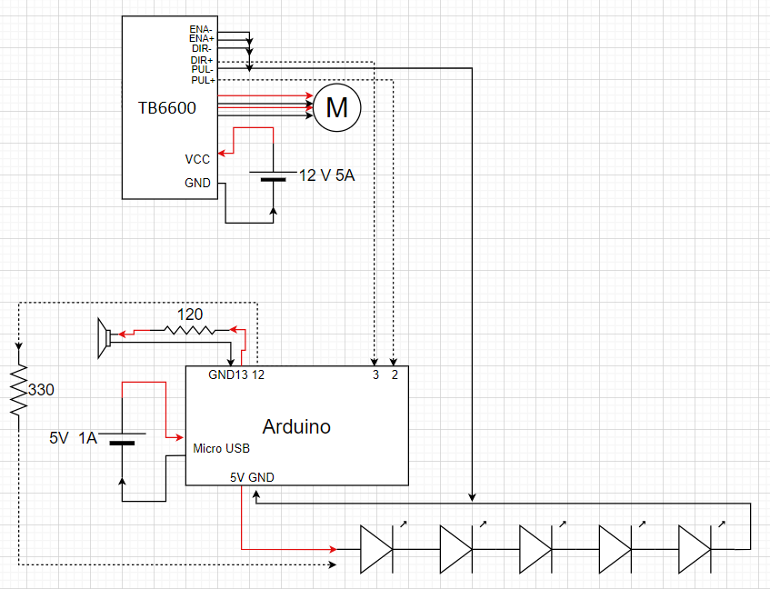
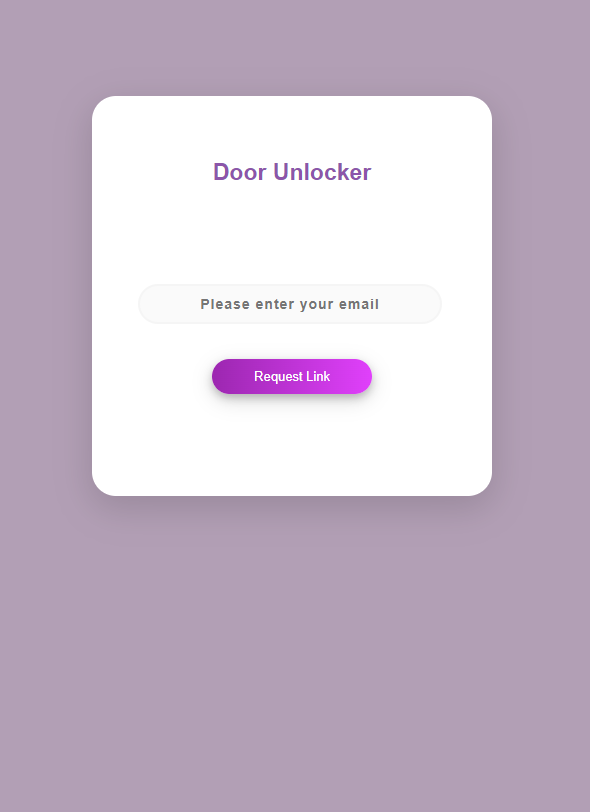
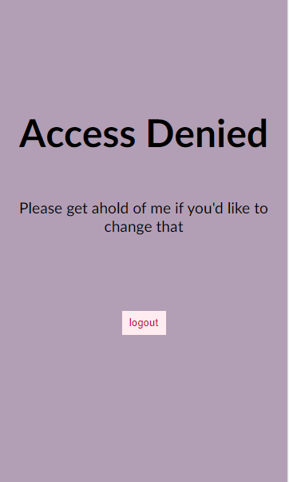
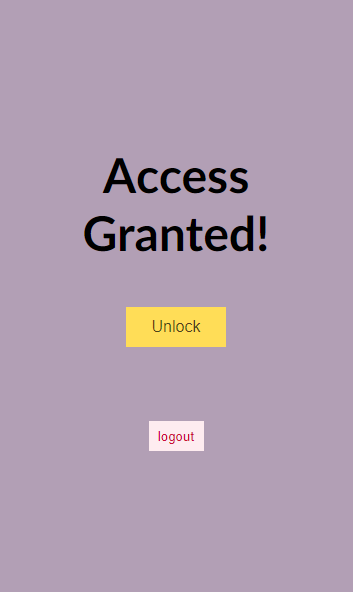
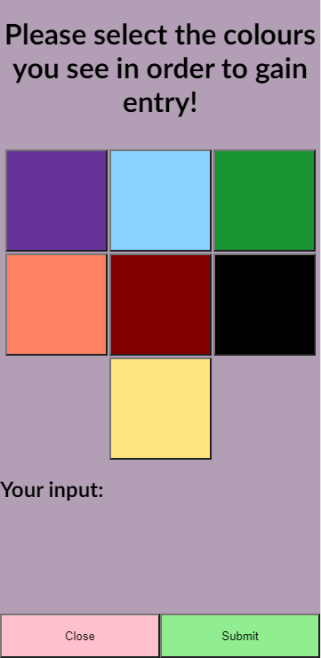
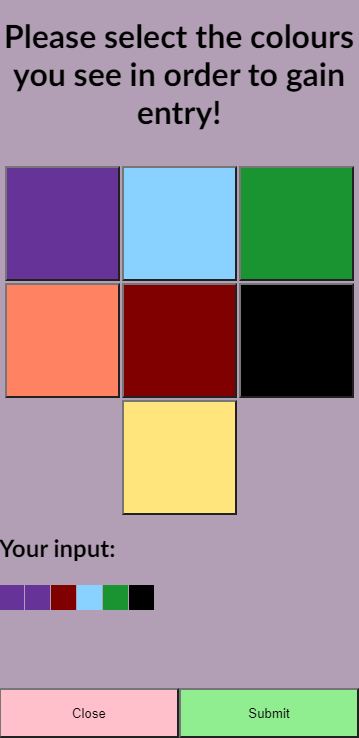
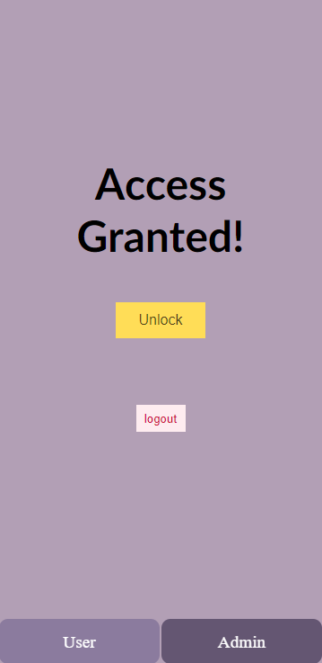
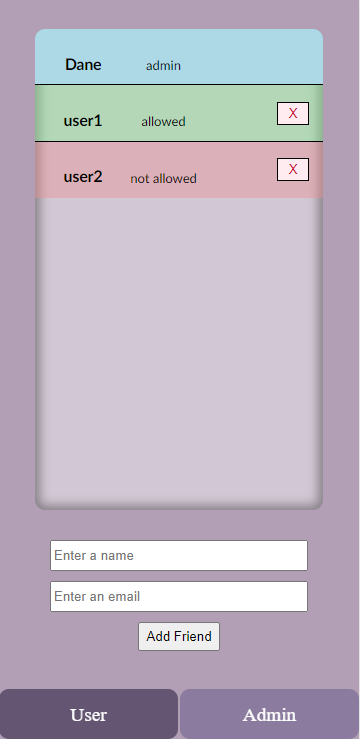

<div align='center'>
<h1>Door-Unlocker</h1>  

<p>As my very first project, Door Unlocker marks the start of my journey in becoming a Software Engineer! As I've learned more over time, I decided it would be cool to revisit the project and make some improvements to its original design!</p>
</div>

<br>
<br>

<div align='right'>

</div>

<br>

## Overview
- [Setting up](#setting-up)
    - [env variables](#env-variables)
    - [Docker-Compose](#docker-compose)
    - [Accessing Containers](#accessing-containers)
    - [Development Servers](#development-servers)
- [Features](#features)
    - [Frontend Features](#frontend-features)
    - [Injectable Modes](#injectable-modes)
    - [System logging](#system-logging)
    - [Scaling Database Connections](#scaling-database-connections)
    - [Producer Consumer Queue](#producer-consumer-queue)
    - [Security](#security)
        - [System Policy](#system-policy)
        - [Session Management](#session-management)
        - [Authentication](#authentication)
        - [Authorization](#authorization)
- [Photos]()
- [Changelog]()

<br>

## Setting up
### env variables: 
Inside of the [docker folder](https://github.com/DaneHarrison/Door-Unlocker/tree/master/docker) you will find a [template](https://github.com/DaneHarrison/Door-Unlocker/blob/master/docker/.env.template) that contains the environment variables needed to run the project. **All of them must be filled in a .env file in the docker folder**. The following are some of the less obvious details:

- <u><b>EMAIL_VENDOR</b></u>: The email service provider used. An extensive list can be found [here](https://community.nodemailer.com/2-0-0-beta/setup-smtp/well-known-services/)

- <u><b>EMAIL_PWD</b></u>: Depending on the email vendor you use, you may need to use their service to configure a secure password to use nodemailer. For example, this is a [link to Googles/Gmail](https://myaccount.google.com/apppasswords). **Note that this option will not be available if you have not yet enabled 2 factor authentication**.

- <u><b>DB_HOST</b></u>: When connecting to a container, localhost only works outside of other contains. This means that you can only connect to the database or access the frontend with localhost **if you are running their respective programs local to your operating system**. Otherwise, you must use the containers name to access the material. By default, I've configured it to be ``door-unlocker-postgres-1``

- <u><b>MECH_MODE</b></u>: Corresponds to the [challenge mode](https://github.com/DaneHarrison/Door-Unlocker/blob/master/src/logic/modes/mode.js) you'd like to use as setup in this [abstract factory](https://github.com/DaneHarrison/Door-Unlocker/blob/master/src/logic/modes/modeFactory.js)

<br>

<div align='center'>
Mostly, these variables are up to your discretion as to what they should be set to
</div>

<br>

### Docker-Compose
Running from Docker is a relatively straightforward process (assuming its already installed and you have created your .env file in the [docker folder](https://github.com/DaneHarrison/Door-Unlocker/tree/master/docker)).

1. Navigate to the docker directory ```cd docker```
2. Run Docker-Compose via: ```docker-compose --env-file .env up -d```
3. Access the frontend at https://localhost
4. Access PGAdmin at http://localhost:5433 
    - **Note**: since this is a container the host will be ``door-unlocker-postgres-1``
5. Add yourself as an administrator via PGAdmin via: ```INSERT INTO public.friends (friend_name, email, access_lvl) VALUES ('your name', 'your email', 'admin')```
    - **NOTE**: your name/your email should remain in quotes but actually reflect your personal information

<br>

### Development Servers
If you intend to make any modifications yourself, please note the following details for your convienence:
1. You will need to install your dependencies:
    - ```npm install``` (for the backend at the root folder)
    - ```npm install -g @angular/cli``` (for the frontend at [src/presentation](https://github.com/DaneHarrison/Door-Unlocker/tree/master/src/presentation))
2. Both the frontend and backend can be restarted automatically via the following commands:
    - ```nodemon index.js```
    - ```ng serve``` 
3. To allow the frontend development server to access the backend you will need to add CORS as such:  

    - run ```npm i cors --save```

    - Add this code to [server.js](https://github.com/DaneHarrison/Door-Unlocker/blob/master/src/api/server.js)
        ```
        import cors from 'cors'; 
        ...

        this._server.use(cors());
        ```
4. You will want to copy the same .env file created under docker to src

<br>

## Features
### Frontend Features
- Users can login/logout
- Users can request and gain entry to shared spaces via an Arduino when they
    - Have a sufficient access level
    - Complete a small challenge

<br>

- Administrators can add new users
- Administrators can modify not allowed/allowed access levels
- Administrators can delete other non administrator users
- Administrators can check who has access **sorted by access level and alphabetically**
- Administrators can check when a user last accessed a space

<br>

<div align='center'>

**If there are more users then what fits on the page, the scrollbar snaps and half of the next user is always displayed as a visual queue**
</div>

<br>

### Injectable Modes
Using the stategy design pattern and abstractory factory class, creating and selecting a different entry challenge types is as simple as creating a new implementation of the [mode interface](https://github.com/DaneHarrison/Door-Unlocker/blob/master/src/logic/modes/mode.js), updating the .env file inside the [docker folder](https://github.com/DaneHarrison/Door-Unlocker/blob/master/src/logic/modes/modeFactory.js), and adding it to the abstract factory class.

Currently, the following modes are available:  
- [LED](https://github.com/DaneHarrison/Door-Unlocker/blob/master/src/logic/modes/LED.js)  

<br>

### System logging
The following logs are recorded with the goal of providing a history of the applications use as well as for future stress testing as well as future index and sharding strategizing.

- **Action Logs**:  
    - The user who triggered the action
    - The action that occured
    - If the action was successful 
    - Other details as necessary
    - The date

<br>

- **Error Logs**: 
    - The error message
    - The name of the file at which the error occured
    - The name of the function at which the error occured
    - The date

<br>

- **Query Logs**: 
    - The query 
    - The parameters used
    - The duration
    - The date

<br>

<div align='center'>

**Not that log responses directly correspond to unique status codes and messages**
</div>

<br>

### Scaling Database Connections
A while ago, I read a book that introduced the concept of dynamic frame sizes in the modified Go-Back-N (GBN) algorithm, which is used in networking to reduce network congestion. This concept inspired me to develop a similar algorithm for managing database connections. This is particularly relevant because establishing new connections to a database can be more resource-intensive than maintaining an open connection.

<br>

As such:
- An increase in traffic will incrementally create new database connections
- A reductions trigger a timeout that eventually kills half of all currently active connections**

<br>

### Producer Consumer Queue
To improve database efficiency, maximize concurrency and improve my asynchronous programming skills I decided to introduce a promise based producer consumer task queue that works as follows:

1. Workers are created, assigned a database connection and promised future work
2. They are ignored by JavaScript's runtime event loop until they are given a task
3. When a task is recieved it goes to the first worker in the queue  
**NOTE**: tasks can be added in the form of:
    -  A query will eventually return the results from the database
    - null resolves instantly and is (used to kill off unnecessary workers worker)
4. If the worker count does not decrease, the worker then pulls its next job or goes back to sleep until the next one is made available

<br>

### Security
#### **System Policy**
A sample policy document can be found [here](https://github.com/DaneHarrison/Door-Unlocker/tree/master/.github/samplePolicy.pdf) that outlines different security measures and precautions that can be used to enforce safe practices

#### **Authentication**
- Door-Unlocker uses email authentication to authenticate users where login links are sent to the email registered in the system
- This delegates the responsabilities of ensuring password strength as well as allows the system to take advantage of 2 factor authentication services already built into most modern day emailing services

#### **Authorization**
- Door-Unlocker uses roles to determine user authorization which include:
    - locked
    - not allowed
    - allowed
    - admin

These correspond with the frontend functionalities mentioned above, however, note that both the locked and admin roles cannot be changed via the frontend interface with that action being restricted to only PGAdmin
- If a user does not have sufficient access for a request, they are locked out

#### Session Management
- Many different cookie configurations are used to ensure system safety such as HTTP only, expirations, secure, and cookie signing
- Cookies are chained together so that in the event it is captured only one session will remain active
- A user can have many different simultaneous connections available (mostly just because I was interested in implementing it that way, I may change this in the future)

<br>

## Photos

<div align='center'>







</div>
    
<br>

## changelog:
- Swapped to an improved and new responsive frontend design
- Raw HTML has been replaced with the Angular framework and TypeScript
- CSS has been replaced with SCSS
- The server now logs actions, requests and errors
- The server uses status codes and error messages
- Window functions were replaced by automated tests ran by GitHub Actions
- JavaScript ES6 standards were adopted especially for the added bonus of tree shaking/optimizing dependencies
- Added a .env which is much better than using configuration files especially since these variables are accessing in Docker
- Added design patterns and swapped code structure to a 3 layer architecture (Singleton, Strategy Pattern and AbstractFactory)
- Added the producer consumer task queue
- Added triggers to increase data consistancy (specifically with sessions as access levels are changed)
- Retired PonyORM and its child processes (which I only used in the first place because I wanted to learn Python) in favor of pg-node and SQL
- Added trailing /s to all routes so they are now more direct and efficient
- Replaced 0Authentication with email authentication
- The database is now automatically seeded via an init.sql file
- The server can now be properly closed via terminal by issuing the close command
- Fixed bugs:
    - throwing errors gave access to the system - access is now denied by default
    - Fixed an issue where not using the subscribe event listener prevented requests from being made to the backend